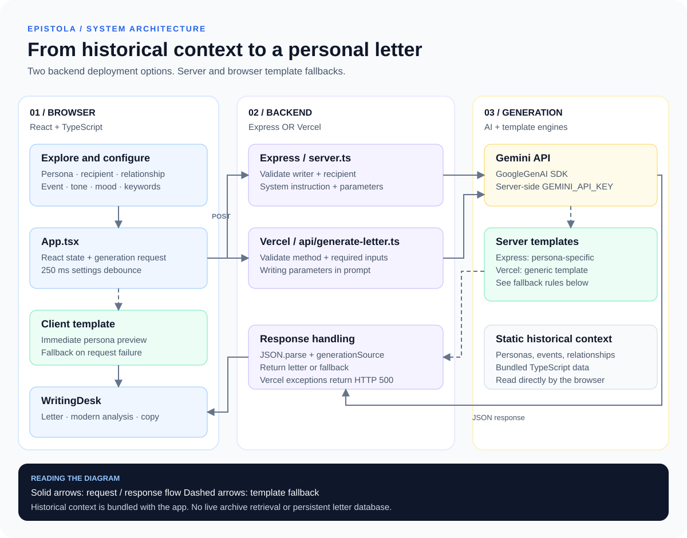

# Letter Writer 2 · Epistola

An immersive historical letter-writing app. Explore the relationships of historical figures, choose a recipient and writing context, and generate a letter alongside a modern interpretation of communication, etiquette, and material culture.

The central experience follows **Albert Einstein, Marie Curie, and Rabindranath Tagore**, with additional personas for Leonardo da Vinci and Benjamin Franklin.

## Experience

- Explore period writing scenes and historical relationship networks.
- Customize the event, tone, emotional mood, and research keywords.
- Generate historical-style correspondence through a server-side Gemini integration.
- Read a modern breakdown of communication speed, social conventions, physical materials, and source references.
- Inspect writing kits and copy a finished letter to the clipboard.
- Continue with bundled templates when the API is unavailable or no key is configured.

Generated letters are creative historical interpretations, not authenticated archival transcriptions. Source references in generated output are not automatically verified.

## System Overview



The browser sends writing selections to `POST /api/generate-letter`. Either the Express server or the Vercel function handles that endpoint. Both can call Gemini and return structured letter content; server and client templates provide fallback behavior.

See [the full system diagram](SYSTEM_DIAGRAM.md) for the detailed architecture, generation sequence, and deployment-specific fallback rules.

## Run Locally

Prerequisites: Node.js 22 LTS and npm. This repository also includes a Bun lockfile; the commands below use npm.

```bash
git clone https://github.com/Wyworange/letter-writer-2.git
cd letter-writer-2
npm install
cp .env.example .env
```

For AI generation, replace the placeholder in `.env` with your Gemini API key:

```dotenv
GEMINI_API_KEY=your_api_key
```

For template-only use, leave `GEMINI_API_KEY` empty or remove that entry. Keep the key on the server; `.env` files are ignored by Git. `APP_URL` appears in the example file but is not used by the current application code.

```bash
npm run dev
```

Open **http://localhost:3000**. Express serves the API and mounts Vite middleware for the frontend.

The Express backend tries `gemini-3.8-flash`, `gemini-flash-latest`, then `gemini-3.1-flash-lite` when responses are empty or errors match its capacity/quota checks. Other errors stop the loop and trigger a template. The Vercel handler only specifies `gemini-3.8-flash`. These are repository settings, not verified available models; review the identifiers in [server.ts](server.ts) and [api/generate-letter.ts](api/generate-letter.ts) for your account.

## Using the App

1. Choose a historical persona and explore their writing environment or relationship network.
2. Select a recipient and historical event.
3. Adjust tone, mood, and keywords. Writing-setting changes trigger generation after a 250 ms debounce.
4. Read the letter and its modern analysis, then copy the letter if desired.

The initial persona selection renders a client template immediately while a server request runs. The UI labels model-generated output as `gemini-3.8-flash` and template output as `archive-engine`. The model label is static and does not identify which Express candidate actually succeeded.

## Commands

| Command | Purpose |
| --- | --- |
| `npm run dev` | Start the Express + Vite development server on port 3000 |
| `npm run lint` | Run TypeScript checking with `tsc --noEmit` |
| `npm run build` | Build the frontend and bundle the Node server |
| `npm start` | Run `dist/server.cjs`; set `NODE_ENV=production` for production serving |
| `npm run preview` | Preview Vite's frontend build; does not start the Express API |
| `npm run clean` | Remove generated `dist` and `server.js` files |

## Deployment

### Node Server

```bash
npm install
npm run build
NODE_ENV=production npm start
```

The server listens on port **3000** at `0.0.0.0` and serves the frontend from `dist`. Run it from the repository root, provide `GEMINI_API_KEY` through the server environment if needed, and keep runtime dependencies installed: the server build leaves packages external. On Windows, set `NODE_ENV` using your shell's environment-variable syntax before running `npm start`.

`GET /api/health` returns `{"status":"ok"}` for this deployment. The port is currently hardcoded in `server.ts`.

### Vercel

The repository includes a separate function at `api/generate-letter.ts` and routing rules in `vercel.json`.

- Import the repository with the repository root as the project directory.
- Use the Vite framework preset, `npm run build` as the build command, and `dist` as the output directory.
- Set `GEMINI_API_KEY` in the deployment environment if you want AI generation.
- Deploy the static frontend and API function together.

The Vercel function is an alternative to the Express server. It uses a shorter prompt and a generic server template; its exceptions return HTTP 500, which triggers the client fallback. There is no Vercel health function in the current repository.

## Project Structure

```text
letter-writer-2/
├── api/generate-letter.ts       # Vercel generation handler
├── server.ts                    # Express API and frontend serving
├── src/
│   ├── App.tsx                  # Navigation, selections, generation requests
│   ├── components/              # Writing desk, scenes, networks, and modals
│   ├── data/                    # Personas, relationships, and historical episodes
│   ├── utils/letterGenerator.ts # Client template fallback
│   ├── types.ts                 # Shared frontend data types
│   └── index.css                # Styles
├── public/assets/               # Public images
├── docs/system-architecture.svg # Visual architecture overview
├── SYSTEM_DIAGRAM.md            # Detailed architecture and sequence diagrams
├── .env.example                 # Example environment configuration
└── vercel.json                  # API and SPA routing
```

## Technology

| Layer | Tools |
| --- | --- |
| Interface | React 19, TypeScript, Tailwind CSS 4 |
| Animation and icons | Motion, Lucide React |
| Development and build | Vite 6, tsx, esbuild |
| Backend | Express 4 or Vercel function |
| AI integration | `@google/genai` |
| Historical context | Static TypeScript data bundled with the frontend |

## Current Boundaries

There is no user authentication, database, saved-letter history, live archive retrieval, or vector search. Selections and letters live in React memory and are lost on refresh. Templates have less variation than model output; the `historical-archive-engine` source label describes bundled templates, not an archive connection.

The API requests JSON output and parses it, but does not validate the result against a runtime schema. Client requests have no explicit timeout or cancellation. The repository provides a TypeScript check but no automated test script.
