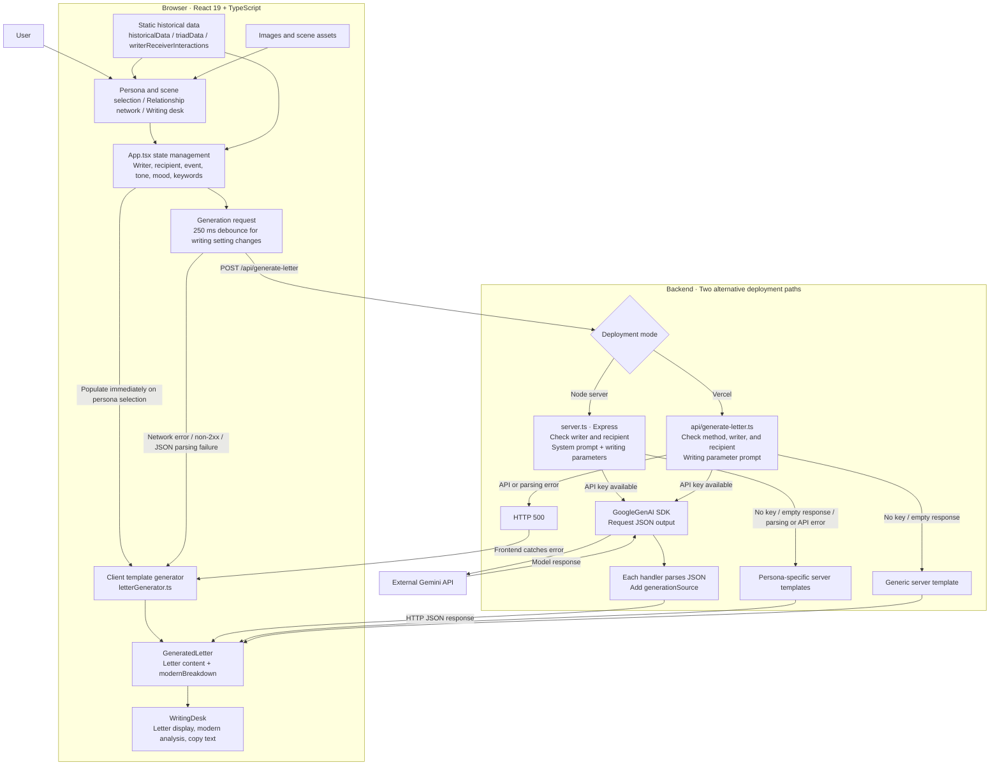

# Letter Writer 2 — System Diagram

Based on the current repository implementation: users select a historical figure, a recipient, and writing settings. The system generates a historical-style letter alongside an analysis from a modern perspective.

## Core Data Flow

1. The frontend reads personas, relationships, historical events, and keywords from static TypeScript data and stores user selections in React state.
2. Selecting a persona immediately populates a letter using a client template, then requests server generation. Changes to writing settings use a 250 ms debounce.
3. The frontend sends `figure`, `recipient`, `event`, `tone`, `mood`, and `keywords` to the same-origin generation endpoint.
4. When `GEMINI_API_KEY` is configured, the backend calls Gemini and returns the JSON result. Errors and missing configuration follow the fallback branches shown above.
5. `WritingDesk` displays the salutation, date and location, body, closing, and postscript, alongside analysis of communication speed, etiquette, material costs, and historical sources. Users can copy the letter.

## Deployment and Implementation Boundaries

| Area | Current implementation |
| --- | --- |
| Local development | `npm run dev` starts Express on port 3000; Vite serves the frontend as middleware |
| Node production deployment | The build produces frontend assets in `dist` and `dist/server.cjs`; run the server with `NODE_ENV=production` so Express serves static files |
| Vercel deployment | Static frontend with `api/generate-letter.ts`; `vercel.json` configures API and SPA routing rewrites |
| Model configuration | Both backend files hardcode `gemini-3.8-flash`; this documents the code configuration, without verifying the model's availability |
| Prompt differences | Express sets `systemInstruction`; the Vercel handler does not set this field |
| Data and storage | Historical material is embedded in source code; the current flow has no database, vector retrieval, live archive queries, or persistent letter storage |
| Output constraints | JSON MIME type and prompt-defined fields, followed by `JSON.parse`; no runtime schema validation |
| Source labels | Model output uses `gemini-agent`; template output uses `historical-archive-engine`, which does not indicate an actual archive database connection |

## Source Files

- [Frontend state and requests](src/App.tsx)
- [Letter display](src/components/WritingDesk.tsx)
- [Express backend](server.ts)
- [Vercel handler](api/generate-letter.ts)
- [Client templates](src/utils/letterGenerator.ts)
- [Data types](src/types.ts)
